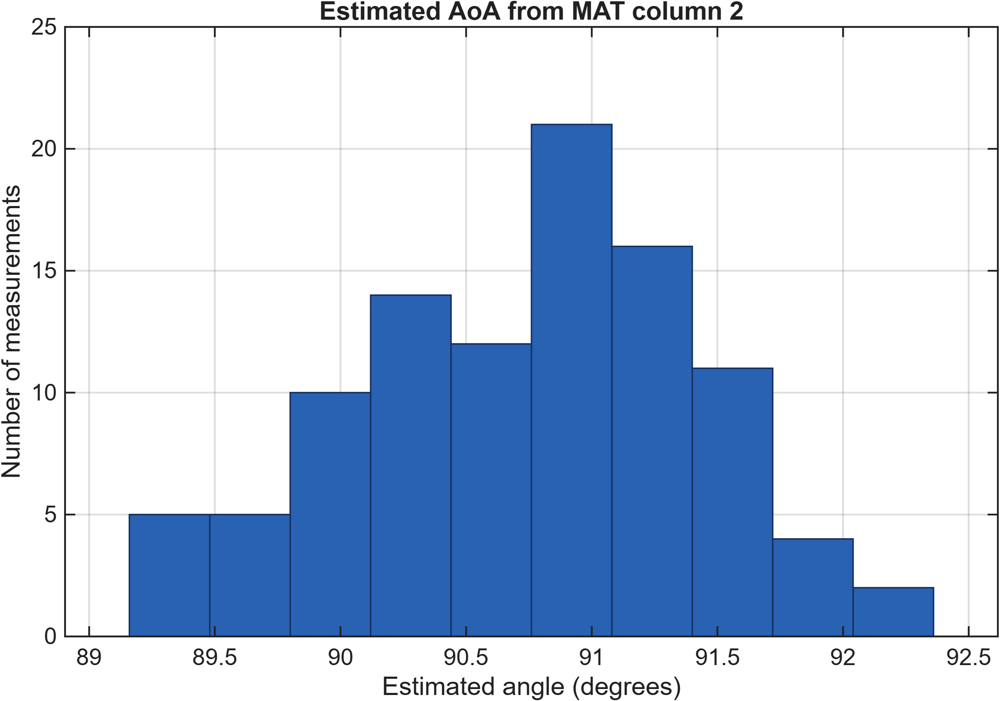
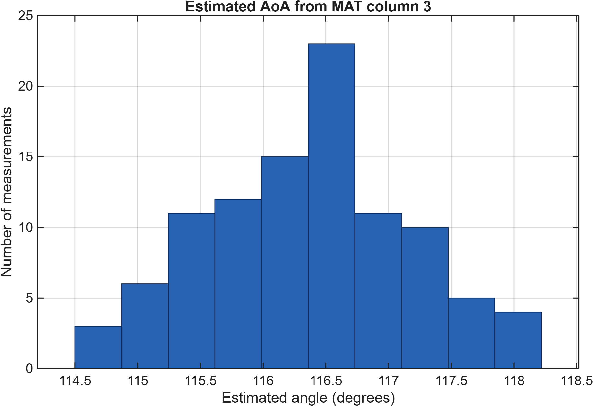
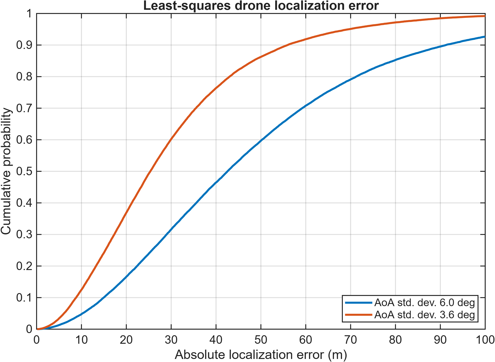
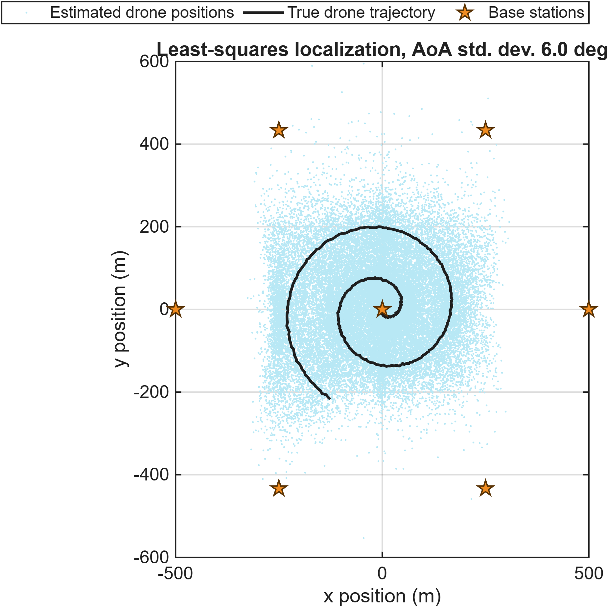

# Measurement-Based Drone Self-Localization Using Cellular AoA

MATLAB code and measurement data associated with:

> M. Meles, A. Rajasekaran, K. Ruttik, R. Virrankoski, and R. Jantti,
> "Measurement based performance evaluation of drone self-localization
> using AoA of cellular signals," WPMC 2021.

- DOI: https://doi.org/10.1109/WPMC52694.2021.9700407
- Aalto research record:
  https://research.aalto.fi/en/publications/measurement-based-performance-evaluation-of-drone-self-localizati/

## Overview

The project has two processing stages:

1. Estimate angle of arrival (AoA) from rotating two-element antenna
   measurements stored in `data/m30.mat`.
2. Evaluate 2D drone localization using noisy AoA measurements and a
   least-squares estimator in a hexagonal cellular layout.

The cleaned code preserves the numerical constants and calculations in the
files supplied by the author. Formatting, naming, documentation, MATLAB figure
labels, output handling, and array preallocation have been improved.

Untouched source files are retained in `legacy/supplied_files/` for
traceability.

## Repository Layout

```text
.
|-- code/
|   |-- estimateAoAFromMeasurements.m
|   |-- publishRepositoryResults.m
|   |-- runReproduction.m
|   |-- simulateDroneLocalization.m
|   `-- twoElemAntenna.m
|-- data/
|   |-- m30.mat
|   `-- README.md
|-- docs/
|   `-- VALIDATION.md
|-- legacy/
|   |-- github_before_cleanup/
|   `-- supplied_files/
|-- paper/
|   `-- paper.pdf
|-- results/
|   |-- figures/
|   |-- tables/
|   `-- README.md
|-- CITATION.cff
`-- README.md
```

## Requirements

- MATLAB R2021a or later
- Statistics and Machine Learning Toolbox (`ecdf` and `prctile`)

The code was validated with MATLAB R2026a on Windows.

## Run

Open MATLAB in the repository root and run:

```matlab
addpath("code");
runReproduction;
```

Generated figures, tables, and MAT files are written to `results/generated/`.

To regenerate the exact figures displayed in this README, run:

```matlab
addpath("code");
publishRepositoryResults;
```

This publishing function uses `rng(12345)` for the Monte Carlo example and
exports every displayed PNG directly from MATLAB with `exportgraphics`.

To make the Monte Carlo simulation repeat exactly, set the random-number state
before running:

```matlab
rng(1);
runReproduction;
```

The original script did not set a random seed, so the cleaned implementation
also leaves the random-number state unchanged by default.

## Preserved Numerical Settings

| Setting | Supplied value |
|---|---:|
| Physical antenna spacing | `0.05` m |
| Frequency variable used with MAT column 3 | `3e9` Hz |
| Frequency variable used with MAT column 2 | `3.03e9` Hz |
| AoA search grid | `0:0.02:180` degrees |
| Cellular geometry scale variable | `250` m |
| Base-station ring multiplier | `2` |
| AoA standard deviations | `[6 3.6]` degrees |
| Monte Carlo realizations | `100` |
| Drone-position perturbation scale | `1` m |

See `docs/VALIDATION.md` for the audit results and scientific items that were
intentionally not changed.

## Example Results

**Figure provenance:** Every image below is an unmodified PNG exported directly
by the MATLAB code in this repository. No generative AI or external image
editor was used.

### Measurement-Based AoA Estimates





### Localization Error



### Estimated Drone Positions



## Citation

Use the repository's `CITATION.cff` file or cite the paper DOI above.

## License

No software license has been selected yet. Until a license is added, copyright
law applies and reuse permission is not automatically granted.
